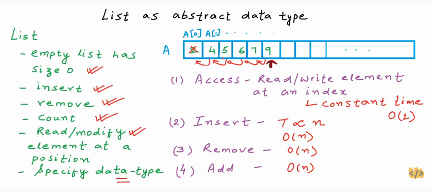

List as Abstract Data Type
List: 
- Store a given number of elements of a given data type
- Wrtie/Modify element at a position
- Read element at a position 
 

We require Dynamic List (not static list)
- Empty list has size 0
- insert
- remove
- count
- read/modify element at a position
- specify data-type
 
 
This can be implemented via Arrays 
 
When Array size is full?
We copy the array to the new array of double the size of old array.
 

 
 
Time Complexities involved in these operations are:
 

Use of Array as Dynamic List?
No, its not efficient wrt to memory usage.

